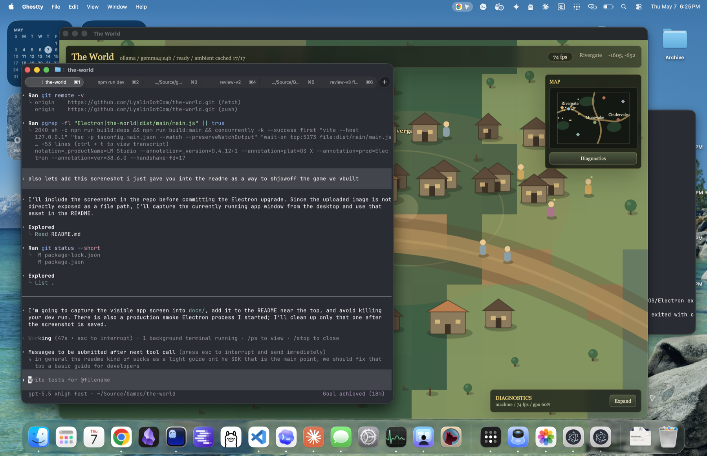

# The World

**The World** is a prototype SDK for game-native local AI plus a playable Electron demo that proves the runtime path works with Gemma through Ollama.

The core promise:

> Dynamic game text without surrendering control of your game.

This repo is not mainly a game. The game is the showcase. The main product idea is a TypeScript toolkit that lets developers turn local LLMs into controlled, schema-bound, lore-aware game systems: NPC dialogue, ambient barks, overheard conversations, memory, policy checks, cache-first runtime behavior, diagnostics, and safe Electron IPC.



## What Developers Get

- `@game-llm/core`: NPC definitions, scene context, schema-bound recipes, prompt compilation, memory, cache, validation, repair, fallback behavior, cancellation, and a deterministic mock provider for tests.
- `@game-llm/ollama`: local Ollama provider with health checks, installed-model discovery, warmup, structured JSON calls, Gemma-friendly defaults, timing/token metrics, and `AbortSignal` support.
- `@game-llm/electron`: safe IPC bridge so a renderer can request dialogue, barks, overheard exchanges, warmup, pregeneration, and cancellation without arbitrary model access.
- `apps/the-world`: a playable canvas/Electron demo that uses the SDK under real runtime pressure.

The package boundary is deliberate: **core knows games, providers know models, apps know their own lore**.

## SDK Quick Start

These packages are local workspace packages right now. A future published version would look like normal NPM installs, but in this repo you can import directly from the workspaces.

```ts
import { createGameAI } from '@game-llm/core';
import { ollamaProvider } from '@game-llm/ollama';

const ai = createGameAI({
  provider: ollamaProvider({
    model: 'gemma4:e4b',
    host: 'http://127.0.0.1:11434',
    keepAlive: '10m'
  }),
  world: {
    id: 'emberfall',
    name: 'Emberfall',
    lore: [
      'Rivergate avoids the old mill after dark.',
      'The Iron Crows are mercenaries, not royal soldiers.'
    ],
    styleGuide: 'Grounded low fantasy. Short sentences. No modern slang.'
  },
  runtime: {
    mode: 'local-only',
    cache: 'session',
    maxLatencyMs: 24_000,
    pregeneration: {
      enabled: true,
      cacheOnlyRuntimeRecipes: ['npc.bark', 'npc.overhear']
    }
  },
  policies: {
    canonOnly: true,
    noQuestMutationWithoutTool: true,
    noRewardCreation: true,
    contentRating: 'T'
  }
});

await ai.provider.warmup?.({
  prompt: 'Warm up for short schema-bound NPC dialogue.',
  timeoutMs: 45_000
});
```

## Define An NPC

The SDK API exposes game concepts, not raw chat.

```ts
const blacksmith = ai.npc({
  id: 'npc.blacksmith.orin',
  persona: {
    name: 'Orin',
    role: 'village blacksmith',
    traits: ['gruff', 'protective', 'superstitious'],
    mood: 'wary',
    speechStyle: 'Short practical replies. Dry humor. No modern slang.',
    knows: [
      'Rivergate locals fear the old mill.',
      'The mill wheel turns on still nights.'
    ],
    doesNotKnow: [
      'the true cause beneath the old mill'
    ],
    rules: [
      'Answer direct questions plainly before adding color.',
      'Do not invent towns, factions, rewards, or player actions.',
      'Do not reveal hidden causes before the player earns trust.'
    ]
  },
  memory: {
    scope: 'npc',
    maxEntries: 50
  }
});
```

## Run Dialogue

Every dialogue request carries structured scene and player context. The model returns a typed `DialogueTurn`, not arbitrary prose.

```ts
const controller = new AbortController();

const turn = await blacksmith.respond({
  playerText: 'Why is everyone scared of the old mill?',
  scene: {
    location: 'Rivergate',
    biome: 'river road',
    timeOfDay: 'late afternoon',
    weather: 'thin cloud',
    nearbyCharacters: ['npc.guard.elda'],
    visibleFeatures: ['The Old Mill', 'river bridge', 'waystone'],
    contextualFacts: [
      'The Old Mill creaks after sunset even when the air is still.',
      'Locals lower their voices when they talk about the mill.'
    ],
    coordinates: { x: -1605, y: -652 }
  },
  player: {
    id: 'player',
    knownFacts: ['The old mill is avoided after dark.'],
    visibleEquipment: ['travel cloak', 'worn boots']
  },
  relationship: 'new acquaintance',
  npcState: {
    mood: 'wary',
    disposition: 10,
    willTalkAgain: true
  }
}, {
  assess: true,
  timeoutMs: 20_000,
  signal: controller.signal
});

console.log(turn.text);
console.log(turn.mood);
console.log(turn.events);
```

`DialogueTurn` includes:

- `text`: the line to show in the game.
- `emotion` and `animationHint`: presentation hints.
- `mood`, `attitudeDelta`, `willTalkAgain`, and `refusalReason`: session state.
- `events`: typed game events such as `dialogue.say`, `npc.emotion`, or `npc.callForHelp`.
- `memoryWrites`: durable facts the game may store.
- `safetyFlags`: warnings or blocks.
- `trace`: prompt, provider, model, latency, cache status, raw output, and schema repair details.

The game engine still owns authority. The model can propose events; the game decides what to accept.

## Dialogue Assessment And Actions

The demo uses three small model calls for player conversations:

1. Generate the NPC reply.
2. Assess mood and danger.
3. Decide whether the NPC should continue, end the conversation, or call for help.

That split is intentional. Small local models are more reliable when each pass has one simple job. The action pass returns an enum, not arbitrary tool execution:

```ts
type DialogueActionType = 'none' | 'endConversation' | 'callForHelp';
```

In the sample game, `callForHelp` spawns constables and ends the conversation. In a real game, the same event would go through the game's validation and authority layer.

## Runtime Controls

Local models can be expensive during play, so the SDK is built around control points.

**Warmup**

```ts
await ai.provider.warmup?.({ timeoutMs: 45_000 });
```

This keeps the model loaded before the player needs the first real reply.

**Cache-first runtime recipes**

```ts
runtime: {
  cache: 'session',
  pregeneration: {
    enabled: true,
    cacheOnlyRuntimeRecipes: ['npc.bark', 'npc.overhear']
  }
}
```

For ambient text, the shipped game pre-generates barks and overheard exchanges, then uses cache-only reads while the player walks. That prevents background Gemma calls from dragging down movement and frame rate.

**Refresh pregenerated content**

```ts
await npc.bark(request, {
  cacheKey: 'bark:npc.guard.elda:rivergate:warning',
  refresh: true,
  writeMemory: false
});
```

**Cancel abandoned requests**

```ts
const controller = new AbortController();
const promise = npc.respond(request, { signal: controller.signal });

controller.abort();
await promise;
```

The Ollama adapter receives the signal. Canceled requests are not converted into fake fallback dialogue.

## Electron Integration

The Electron package keeps model access in the main process. The renderer gets a narrow bridge.

Main process:

```ts
import { createGameAI } from '@game-llm/core';
import { registerGameAIIpc } from '@game-llm/electron';
import { ollamaProvider } from '@game-llm/ollama';

const ai = createGameAI({
  provider: ollamaProvider({ model: 'gemma4:e4b' }),
  world: { id: 'the-world' },
  runtime: { cache: 'session' }
});

const cleanup = registerGameAIIpc(ipcMain, ai);
```

Preload:

```ts
import { contextBridge, ipcRenderer } from 'electron';
import { exposeGameAIBridge } from '@game-llm/electron';

exposeGameAIBridge(contextBridge, ipcRenderer);
```

Renderer:

```ts
const requestId = `dialogue:${npc.id}:${Date.now()}`;

const turn = await window.gameAI.dialogue({
  requestId,
  npc,
  request,
  options: { assess: true }
});

await window.gameAI.cancel({ requestId });
```

The IPC bridge validates payloads with the shared Zod schemas from `@game-llm/core`.

## The Playable Demo

`apps/the-world` is a stress test for the SDK ideas:

- Fixed large 2D map with Rivergate, Mosswake, Cindervale, woods, roads, houses, and marked landmarks.
- Random spawn near one of the towns.
- Click-to-talk NPC interaction with free-text Gemma replies.
- NPC mood/disposition state and Gemma-controlled refusal/end-conversation behavior.
- Private NPC groups that speak to each other and refuse interruption.
- Ambient stage manager that caps visible ambient speakers, rotates topics, and moves NPCs together before short exchanges.
- Pregenerated ambient cache so walking does not constantly call Gemma.
- Minimap, invisible map walls, building collision, walking effects, and live FPS.
- Diagnostics panel for provider/model/cache/fallback, prompt traces, CPU, GPU, GPU memory, machine memory, app memory, and optional JSONL performance logs.

The renderer intentionally has no playable fake-AI fallback. If the Electron/Gemma path is broken, the demo should make that obvious.

## Run The Demo

```sh
npm install
npm start
```

For renderer development with Vite:

```sh
npm run dev
```

The demo defaults to `gemma4:e4b`. Override the model with:

```sh
THE_WORLD_MODEL=gemma4:e2b npm start
```

Expected startup log:

```txt
The World: renderer loaded.
The World: Gemma IPC bridge ready.
The World: warmup ready (ollama gemma4:e4b)
```

## Verification

```sh
npm run typecheck
npm test
npm run build
```

The current Electron dependency is `42.0.0`. The upgrade removes noisy macOS native menu logging from older Electron versions and keeps the demo on the current stable Electron major.

## Repository Layout

```txt
packages/core
  Runtime types, schemas, recipes, prompt compiler, cache, memory,
  repair, mock provider, and tests.

packages/ollama
  Ollama provider, model discovery, warmup, structured JSON generation,
  request cancellation, and tests.

packages/electron
  Main/preload IPC bridge, shared schema validation, request cancellation,
  pregeneration bridge, and tests.

apps/the-world
  Electron shell, canvas renderer, procedural world, ambient director,
  diagnostics, performance logging, and playable demo.
```

## Roadmap

- YAML authoring for NPCs, recipes, lore, and policies.
- Lore retrieval with embeddings.
- Tool wrappers for read-only game-state queries and validated proposed writes.
- Prompt replay and schema failure inspection in devtools.
- Save-file memory integration.
- Better packaging with app icon, installer flow, and model setup UX.
- Provider adapters beyond Ollama.

## Agent Continuity

Long-term project direction is captured in `AGENTS.md` so future sessions keep the same north star: Gemma-powered game life, no fake playable AI fallback, typed game-safe outputs, and a bounded navigable world.
